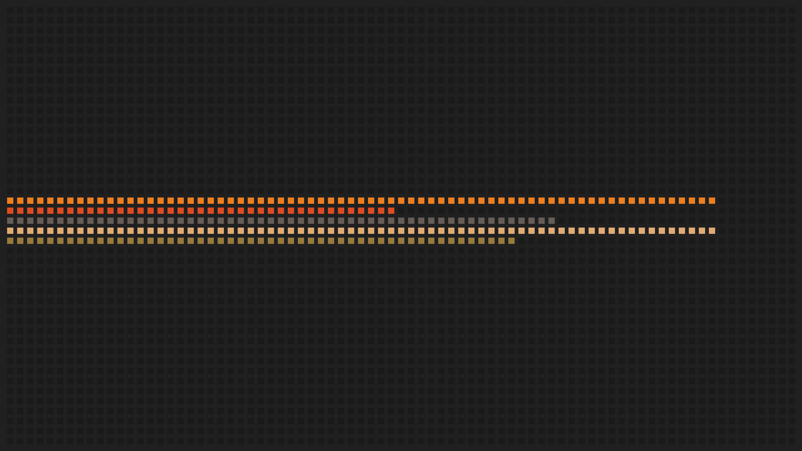
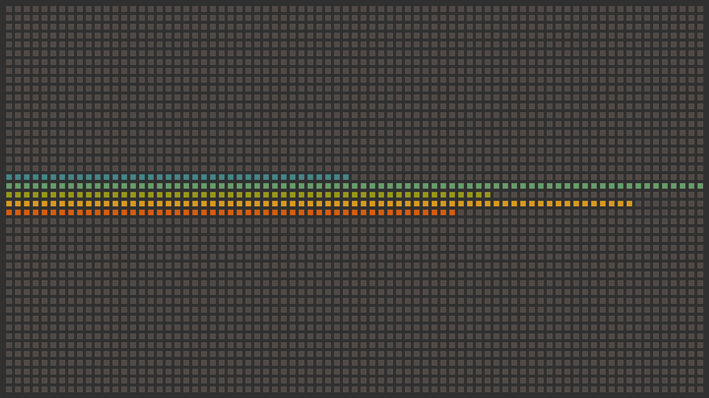

# Generate Image

a Gruvbox wallpaper generator crafted in C++, highly customisable featuring colored squares.

It can be associated with system data values and feh to generate dynamic wallpaper.

Inspired by this [Gruvbox wallpaper](https://wallpaperaccess.com/full/8207835.png)



## Installation

[CImg Library](http://cimg.eu) is included

1. Clone the repository:
```shell
git clone https://github.com/your-username/gruvpaper.git
cd gruvpaper
```
   
2. Compile the project:
```shell
mkdir -p build
cd build
cmake ..
make
```
   
## Usage
```shell
../bin/gruvpaper [options] <data_values...>
```

## Options
```shell
-w, --width WIDTH : Set the image width (default: 1920)
-h, --height HEIGHT : Set the image height (default: 1080)
-s, --square-size SIZE : Set the square size (default: 14)
-i, --inner-margin MARGIN : Set the inner margin (default: 10)
-o, --outer-margin MARGIN : Set the outer margin (default: 10)
-b, --background COLOR : Set the background color (default: #32302F)
-e, --empty-square COLOR : Set the empty square color (default: #504945)
-r, --border COLOR : Set the square border color (default: #665C54)
-c, --colormap COLORS : Set the colormap (comma-separated, default: #458588,#689D6A,#98971A,#D79921,#D65D0E)
-d, --output-dir DIR : Set the output directory (default: .)
-f, --output-file FILE : Set the output file name (default: image_with_colored_squares.png)
-?, --help : Show help message
and a list of values from 0 to 100, i.e. 50 100 70 90 65
```

## Example
```shell
./gruvpaper/bin/gruvpaper \
  -d ./examples \
  -f example_2.png \
  -w 1920 \
  -h 1080 \
  -s 14 \
  -i 10 \
  -o 10 \
  -b "#32302F" \
  -e "#504945" \
  -r "#665C54" \
  -c "#458588,#689D6A,#98971A,#D79921,#D65D0E" \
  50 100 70 90 65

```

## Dynamic wallpaper example with feh
```shell
#!/usr/bin/env bash

killall -q gruvpaper.sh

# Create the wallpaper directory if it doesn't exist
output_dir="/tmp/wallpaper"

#Copy gruvpaper file (the one in /bin after compilation) to the desired location
gruvpaper="$HOME/.config/gruvpaper/gruvpaper"

# Create output directory if it doesn't exist
mkdir -p "$output_dir"

calculate_log() {
    local value=$1
    echo "l($value+1)" | bc -l | awk '{print int($1)}'
}

calculate_exp() {
    local value=$1
    echo "e($value)" | bc -l | awk '{print int($1)}'
}

calculate_sqrt() {
    local value=$1
    echo "sqrt($value)" | bc -l | awk '{print int($1)}'
}

i=1
while [ true ]
	do

  # Collect system metrics
  cpu_usage=$(grep 'cpu ' /proc/stat | awk '{usage=($2+$4)*100/($2+$4+$5)} END {print usage}')
  mem_usage=$(free | grep Mem | awk '{print $3/$2 * 100.0}')
  load_average=$(cat /proc/loadavg | awk '{print $1 * 100.0}')
  temperature=$(sensors | grep 'Tctl' | awk '{print $2}' | tr -d '+°C')
  task_count=$(ps aux | wc -l)

  # Apply transformations to avoid small numbers
  cpu_usage_exp=$(calculate_exp $cpu_usage)
  task_count_sqrt=$(calculate_sqrt $task_count)

  # Check if the values are valid
  if [[ -z $cpu_usage_exp || -z $mem_usage || -z $load_average || -z $temperature || -z $task_count_sqrt ]]; then
      echo "Error: One or more calculated log values are empty or invalid."
      exit 1
  fi

  #echo "CPU Usage : $cpu_usage_exp"
  #echo "Memory Usage : $mem_usage"
  #echo "Load Average : $load_average_exp"
  #echo "CPU Temp Log: $cpu_temp_log"
  #echo "Task Count sqrt: $task_count_sqrt"

  output_filename=wall_${i}.png

  # Generate image with gruvpaper
  "$gruvpaper" \
    -d "$output_dir" \
    -f "$output_filename" \
    -w 1920 \
    -h 1080 \
    -s 14 \
    -i 10 \
    -o 50 \
    -b "#32302F" \
    -e "#504945" \
    -r "#665C54" \
    -c "#458588,#689D6A,#98971A,#D79921,#D65D0E" \
    $cpu_usage_exp $mem_usage $load_average $temperature $task_count_sqrt

    # Set wallpaper to the newly generated image (double screens)
		feh --bg-fill $output_dir/$output_filename --bg-fill $output_dir/$output_filename

    i=$(( ${i}*-1 ))
    sleep 2
  done

```
